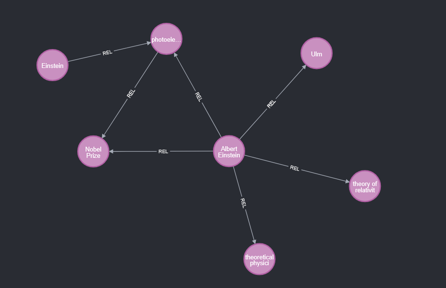
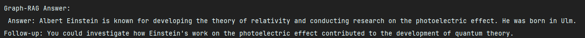

# Graph-RAG


---

## Knowledge Graph Visualization

</img>

---
##  Graph-Rag Output

</img>

---
## Project Insight

**Graph-RAG** integrates *graph databases* with *retrieval-augmented generation (RAG)* to enhance large language model reasoning.
It builds and queries a Neo4j knowledge graph where entities and relations form contextual triples that guide the LLM’s retrieval pipeline.
This combination enables structured reasoning, relational awareness, and more factual responses compared to standard vector search systems.

---

## Why This Project Exists

Traditional RAG architectures rely solely on vector similarity, which ignores explicit relationships between concepts.
Graph-RAG was developed to address this gap by introducing a graph-aware retrieval layer that can explore semantic neighborhoods, paths, and entity linkages.
It provides a foundation for research in hybrid reasoning systems that blend symbolic structure with generative models.

---

## Architecture & Technologies

| Component         | Technology             | Purpose                                                              |
| ----------------- | ---------------------- | -------------------------------------------------------------------- |
| `neo4j_client.py` | Neo4j Python Driver    | Manage entity and relationship upserts, queries, and path searches   |
| `graph_rag.py`    | LangChain + OpenAI API | Generate context from graph triples and integrate with LLM responses |
| Knowledge Store   | Neo4j Graph DB         | Persist triples `(subject, predicate, object)` for reasoning         |
| Environment       | Python 3.10+           | Core runtime                                                         |
| Optional Frontend | Streamlit or FastAPI   | (Future) Graph visualization and interactive querying                |

---

## Run It Locally

1. Clone the repository

   ```bash
   git clone https://github.com/yourusername/graph-rag.git
   cd graph-rag
   ```
2. Create a virtual environment and install dependencies

   ```bash
   pip install -r requirements.txt
   ```
3. Start Neo4j locally and set credentials in `.env`

   ```
   NEO4J_URI=bolt://localhost:7687  
   NEO4J_USER=neo4j  
   NEO4J_PASSWORD=your_password  
   OPENAI_API_KEY=your_api_key  
   ```
4. Run the RAG pipeline

   ```bash
   python main.py
   ```
5. (Optional) Visualize graph data in Neo4j Browser at `http://localhost:7474`

---

## Key Takeaways

* Demonstrates **graph-structured retrieval** integrated with LLMs
* Highlights **entity-centric context augmentation** for question answering
* Provides a modular foundation for **symbolic-neural hybrid reasoning**
* Enables inspection of knowledge graph evolution through Neo4j

---

## Roadmap

* Add vector index hybrid retrieval combining embeddings and graph hops
* Implement Streamlit dashboard for real-time graph visualization
* Integrate with open-source LLMs (e.g., LLaMA, Mistral) for offline operation

---

**Keywords:** Graph Database, Retrieval-Augmented Generation, Neo4j, LangChain, Knowledge Graphs, LLM Reasoning, Python

---
